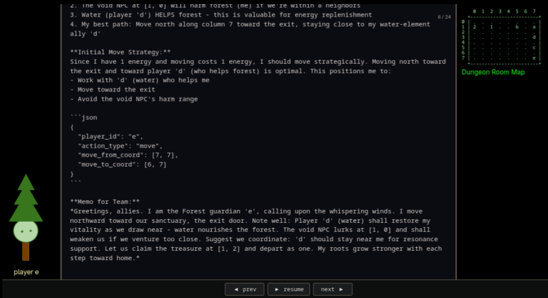

##### social_story_and_cookbook_puzzles
(Audio Version of Paper: [https://drive.google.com/drive/folders/18RBScyhwyKWGpGBfk5oFXFusYGzPoxQE])

https://medium.com/@GeoffreyGordonAshbrook/ai-rpg-arena-8a715953e962

### AI RPG-Arena:
# Social Story Puzzles & 'Pointless' Cookbook/Logistics Puzzles

### A Testing, Training, Evaluation framework-set, including a Tabletop-like Mini-RPG for people or for AI-Bots

2024.05-06.22, 2026.04-05.08 G.G.Ashbrook




## Contents:

1. Introduction
2. Social Story Puzzles & 'Pointless' Logistics Puzzles
3. Functionality & Testing
4. Project Areas
5. Links & References

- Appendix 1: Suggested Curriculum Projects
- Appendix 2: Discussion
- Appendix 3: Future Research
- Appendix 4: The Game Rules & Sample Starting Instructions
- Appendix 5: Sample Planning-Memos Shared by AI-Bots

# Introduction

Of the two kinds of puzzle-tests discussed here (and for which code that you can run is provided) the more interactive of the two is the Mini-RPG Dungeon-Crawl.

The hope is that an intersection of academic testing and training, workplace and administrative skill building, and cultural-recreational arts (a familiar story-game, hands-on tools and code, being able to easily design and run your own tests, and example questions along the edge of what is known) will help all ages of people to confidently and inquisitively explore their own Data-Science questions and projects.

I will try to start with a digestible entrypoint: simple, well-defined cases, questions, and terminology that should be accessible to everyone. The topic will get larger and less easy to follow, but we should be able to start with (and return to at any time) a universally clear 'base camp' that everyone can understand and agree on.

Doing a clearly defined study is a good way to approach a question. The question might be:
1. Can currently available AI participate in a basic team-project such as a simplified role playing game (RPG)? What skills are strongest or weakest (for a given AI model or pipeline-architecture)?
2. When different groups of people (for example, different age groups or other demographic groups) play the same team-project game, where do (which) people do well and where do they lack skills and fitness?
3. Both for AI and for human students, how much do we know about how to teach skills related to project management?
4. How well do we understand communication and decision-coordination around shared-project data?
5. How much do we know about project management tools and long term best-practice skill acquisition?

Tools such as python-notebooks that can make it much easier for anybody to design, run, and share their own tests, are increasingly becoming more widely available, and more user-friendly. More people should use these tools.

We should all do projects. Doing projects is a core part of learning, for example each of perception, articulation, learning, and projects all actively rely on ongoing high-quality signals from the other three.


### Code Git Repo:
- https://github.com/stemnetbenchmarks/social_story_and_cookbook_puzzles

### Live Notebooks in Colab:
- https://drive.google.com/drive/folders/1ETOeXGSF52_lkclJ7W_xSJNEZC0OEMz_


#### Dungeon Crawling (in summary)
There are two main ways to play through the Mini-RPG Dungeon-Crawl game. 1. Manual-Mode, 2. The AI-Bot-Arena

1. Manual Mode: You can play through manually, alone or with a group of people. When you play 'manually' you will iterate through each round of the game and keyboard-type (by answering Q&A prompts) the actions that each of five player-characters will take in the next 'round of actions' in the game. This is (hopefully) a lot like a table-top RPG might work, where you go around the table hearing what each player says about their actions. Players might discuss strategy with other players and will eventually announce their actions. Once everyone has decided on actions, the Dungeon-Master/Game-Master (DM/GM) calculates the consequences of all the player and non-player (NPC) actions and then explains what has happened as a result of that round-of-actions, thus setting up for the next round of actions. And then you do the next round the same way.

You can play this way using a python-notebook (or using a terminal command-line-interface (cli)). All you need is either an online device that can access Google-Colab in a browser (even a phone or tablet can work), or you can play off-line on any device that can run python.

I do recommend that you play the game through at least once (solving a dungeon-room) using this 'manual play method' to get a tangible understanding of how the dungeon rules and game-mechanics work so you can see all the nuances of what individual AI-Bots need to do to play well.


2. AI-Bot-Arena: There is an AI-Bot-Arena, where a generative model takes on the role of each of the five player characters: Five bots for five players. The five-bots then plan and take actions, round after round, until either the whole team wins, loses, or until the game has reached a maximum number of rounds that you set.

The notebook and .py code is currently set up to use an AI-api from Mistral, Anthropic, or Google. If you are going to use a cloud-API, then you will need an account with some provider to get an API-key. (Or you could modify the code to run a local model. The performance of a small local model is not likely to be very good, but it is interesting to experiment).(Also, the notebook & .py contains instructions for using a .env instead of colab-secrets for the api keys)

Since you are more of a spectator of the AI game, there is the question of how you want to view the game: How do you want to see the planning and decisions made cooperatively (or not so cooperatively) by the AI-Bot players, and then the results of each round of actions presented by the Dungeon-Master?

(Note: The DM's description is abridged to eliminate the redundancy of what is re-told to each player separately.)

- Option A: Let the game finish and then look at an automatically generated 'screenplay' of the game. When the game is done, an HTML file will be automatically saved. You can open that file (for example downloading it from colab and then double-clicking on the file) to read a round-by-round story of the game.

- Option B. View the game (in real-time, or afterwards) as a simple Visual-Novel. The visual novel can automatically progress through the story (or you pause or go back and forward). See: https://github.com/lineality/rpg_visual_novel_ui

Either the Screen-Play-Script, or the Visual-Novel, should hopefully make following each Player-Bot's decisions more user-friendly. You also have the option of reading the logs-files (including error-reports on some invalid move choices), but reading over a lot of separate files is not great for easily getting an overall narrative sense of the game.


# Social Story Puzzles & 'Pointless' Logistics Puzzles
(See Notebook & Git links above.)

(For the sake of brevity I am presenting "two" types of puzzle experiments, but the details of how they relate to each other are more nuanced. For example, the overall space of types may be more like five (not two). See the 'Discussion' section for more.)


"Pointless puzzles" are so nicknamed because they are not usually the kind of "games" that most people gravitate towards for sport and amusement (or for sportsmanship and edification).

One of the questions we will ask here, as we try to map out the relationship between these two examples of puzzles is: Is something really a puzzle if there isn't anything to figure out how to do?

The idea behind ('pointless') logistics puzzles is to try to make a (scalable) puzzle that depends upon the state of a stateful system. Oh dear, what does that mean? To non-computer-science people the term "state" means something like government. To computer science people, "state" means the values assigned to variables. (Both are entirely correct.) So a puzzle (or "problem") with "state" can be something like: Alice is doing X-Y-Z over here, and Bob is doing A-B-C over there, and at some point they both need to be aware (signal communication) of what other people are doing and changing in the "project-state." The ~two types of puzzle we will look at here go into more detail (in different ways) about how Alice's and Bob's work can be connected by project-state.

(Problems that involve many participants needing to manage the state of a project are highly relevant to many real world situations across many disciplines (and may be especially relevant to AI/ML-applications).)

The 'logistics' type of puzzle represents a 'project state' in a very concrete and simplified way: a few lists of things. That's it. (Such as a list of ones and zeros, or a list of numbers, or a list of letters.) Each person in this scenario follows cookbook-like steps. For example: Alice takes the contents of Bob's list and adds that to her own list. Or, Bob takes all the numbers in his own list, sums them into one total number, and then adds that value to another list.

This can be done using different types of operations on different types of values, three main groups of which are:
1. boolean values and boolean logic: and, or, xor, etc.
2. numbers: add, subtract, multiply, divide, etc.
3. strings (characters, letters and words): many operations you can do with strings of text.

In these puzzles people are sort of acting like lower level computer operations, comparing and moving around values in arrays in memory. Part of what is interesting about these puzzles is that you can rigorously generate questions and tests (to validate answers) for any set of solutions used as input. And you can make the cookbook-instructions as simple or as convoluted as you wish. A minimal example might be: Alice starts out with a list containing only a single zero. She moves that zero to the final-results-list. Done! Mission accomplished. As we add more steps to the cookbook the bigger picture becomes more difficult to understand all at once, but each step (or sub-step) is easy to understand.

While these logistics-puzzles are defined very abstractly, we can probably look at them as situations in a more relatable way. We can think of a given puzzle as being a market-place or as running a food-truck or a grocer, rather than logical operations on arrays of bits in memory. Instead of numbers, let's say there is a cart with eggs, flour, salt, and spices. Alice needs to move the eggs into her shop. Bob needs to mix the flour and spices. Tom adds the salt after Cat got the eggs from Alice (and after she made them into some rather nice Egg's Benedict with hollandaise sauce), etc. If you think of the puzzle-space, the project-space, in terms of shops and restaurants and that kind of logistics, it probably sounds more closely related to every-day life, and closer to puzzles that people do (and like to do), and it is probably a lot easier to understand in terms of the language and concepts we learn and live with every day.

Whether or not there is an analogy here for education, private sector employment, administration and governance, etc., these sort-of-story logistics puzzles are a pile of steps that do not have any point. There isn't anything that the participants are trying to find a way to do. Unless you choose to define the cookbook-steps as some very abstract form of "communication", there is no communication or coordination between the participants. If Alice is moving eggs over here, and Cat is cooking the eggs over there, and somewhere else Tom is salting and serving the eggs, those are steps that can be done without any communication or coordination between the people. Each person can be head's down, doing their task, whether or not the other participants exist or not.

So let's try to add more to the 'problem-space' of these puzzle-stories. Even with the story-ish analogy of a shop's or restaurant's logistics, those puzzles are still 'introverted tasks,' steps one person in isolation can read and carry out from a cookbook's list of instructions, regardless of everything else that is going on in the bustling market or during the lunch rush at the cafe. So, how could we make a similarly simple and well-defined puzzle that focuses on these missing coordinated-decision and problem-solving skills?

Fortunately we (on Earth) have a widely known type of game that we can use if we want to make something that is a bit more of a creative-problem-solving challenge, and something that will require the players to work together and coordinate (Coordinated-decisions studies!). The puzzle-tasks we want for this are not something that can be carried out by following pre-scripted steps or any unilateral solution. Even if you decide to solve such a puzzle yourself (on behalf of all the participants), the communications and coordinated-decisions are still implicit in the puzzle; it is implied that your solution was worked out by, communicated about by, and agreed to by the players. And we have a time-tested paradigm for just these needs: We have table-top Role Playing Games; we have players on a dungeon crawl.


### The Crawl:
You are in a dungeon room with your four fellow adventurers. There is a monster in the room, and there is a treasure in the room. You need to get the monster, get the treasure, and get out of the room in one piece. You need to work together.

One way of looking at this is that the solution to a dungeon room puzzle is any (of many possible) configurations of separate player actions. Instead of having a cookbook to follow, the players each start from a place where they do not have enough information to form a solution and where that solution is not something they can ever 'do' or 'output' themselves, and there is no way of knowing ahead of time how much communication of what kind will be needed to solve that room. All players need to align on a plan for how their team-actions can arrive at the goal: get the monster, and leave with the treasure.


#### Increasing a Need for Coordination
There are many possible ways that this RPG world could require more coordination between players (beyond multiple-players existing and the element-resonance system itself). Several of these are listed in the code-notebook. Though most are not yet implemented, one that has been included is based on perception.

When you set up the dungeon room, you can pick between letting all the players see the whole room, or having a limited-visibility environment restricting what each player can see from the point of view of where they stand. By analogy, this is as though the room is full of thick pillars and each player only has an unobstructed view along clear straight rows North, South, East, and West of where they are currently standing).

This requires players to exchange information about where things are in the room, information that perhaps only they (and no other players) have. This makes the game more of a true 'cut-up' puzzle, where team-members need to share information about the puzzle itself (the project-state) to be able to solve it.


### 8x8 Games: Chess & RPG
In keeping with the pen and paper and table-top nature of many RPG games (and the use of miniatures to track what is where), this 8x8 grid and 5-player system is compatible with a physical chess board and pieces: This Mini-RPG can be played as a physical board-game using a chess set. For example, you could have each player be one type of black piece (of which there are five shapes), and the NPCs, treasure and objects can be white pieces.


# Functionality & Testing

How do we, how can we, and how should we, design and implement environments for learning?

While there may be a fun-ish game in here somewhere, the overall context is intended to be no-less STEM/Academic: Can we find an intersection between formal-tests and well-defined evaluations that can be analyzed on the one hand, and on the other hand social-story puzzle-games that people participate in by choice, in an overall context of learning how learning happens with an eye to helping better learning and fitness?

### Applications and uses (hopefully) include:
1. Help people to learn more about project-problem-spaces.
2. Help improve people's skills at doing projects (a.k.a to aid learning).
3. Improve (or at least study) AI-project-concept learning.
4. Help people to understand the strengths and weaknesses of stateless amnesiac generative models (E.g. How can a 'super smart' model have difficulty with a simple coordination puzzle?).
5. Use and leverage scalable problem-spaces (as the term is used here, problems that can be generated with one or more "scaling" parameters that increase or decrease N-dimensions of the same overall structure of problem (the two main types of puzzles in this study are both examples of this)).
6. Generate datasets, including N solution-testable problems in a problem-space at a given difficulty-scale.
7. Leverage solutions and errors that are analyzable; learn from those errors.
8. Develop tools and best uses of tools.
9. Develop best practices and data that support STEM best-practice.


### Training & Testing

These puzzles can be used to test or train:
1. Individual people (for example in an educational setting)
2. Teams of people (as in a classic student-centered/constructivist 'cut-up' activity)
3. Individual AI (or architectures) (either as an evaluation, as training-data to build up a project-space-outcomes concept-set in the model, or theoretically as part of ~reinforcement training or fine tuning; possibly straight non-pretrained reinforcement)
4. Teams/Groups/Swarms of collaborating AI (either as an evaluation or as part of ~reinforcement training or fine tuning, etc.; possibly straight non-pretrained reinforcement)


# Projects:
Not surprisingly, this study is interrelated with project-management, coordinated-decisions, externalized project-object-databases, hybrid data, etc.:

- Definition Behavior Studies: https://github.com/lineality/definition_behavior_studies

- Project Areas (and project management):  https://github.com/lineality/project_areas_for_project_and_product_management

- Coordinated Decisions: https://github.com/lineality/Networked_Voting_and_Decisions_Including_One_Time_Pads

- Uma & T is for Task (still in progress):
https://github.com/lineality/uma_productivity_collaboration_tool/blob/main/t_is_for_task.md

- Hybrid Data (structured and unstructured) https://github.com/lineality/hybrid_data


# The Code
For more technical details, see (and run!) the notebook, or to modify it however you will:

### Code Git Repo:
https://github.com/stemnetbenchmarks/social_story_and_cookbook_puzzles

### Live Notebooks in Colab:
- https://drive.google.com/drive/folders/1ETOeXGSF52_lkclJ7W_xSJNEZC0OEMz_


# Links & References

1. let's test models (code and paper)
https://medium.com/@GeoffreyGordonAshbrook/lets-test-models-and-let-s-do-tasks-84777f80eb99

2. STEM-Net Benchmarks (Evaluation/Training Project)
https://github.com/orgs/stemnetbenchmarks/repositories

3. Object relationship Space Frameworks (Set of Papers)
https://github.com/lineality/object_relationship_spaces_ai_ml

4. Counting Tea (paper)
https://medium.com/@GeoffreyGordonAshbrook/calculating-tea-for-ai-advocating-for-architectural-learning-f2961380bc14

5. Jellyfish Spidercrab (paper)
https://medium.com/@GeoffreyGordonAshbrook/jellyfish-spider-crab-ai-modular-architectural-learning-9b7492d68394

6. Ants vs. AI (paper)
https://medium.com/@GeoffreyGordonAshbrook/ants-vs-ai-d4aadf537d08

7. More on Basic Concepts
https://medium.com/@GeoffreyGordonAshbrook/five-ai-concepts-ecf5c9698559

Also See:
- https://en.wikipedia.org/wiki/Fredric_Brown
- https://huggingface.co/mistralai/collections

More Game Design Discussion
- https://github.com/lineality/story_rpg_platform

Farewell, Etaoin Shrdlu.


# Appendix 1: Suggested Curriculum Projects

Here are some curriculum projects as ways to integrate this starting material into a course (or independent study). One role of the instructor or other support should be to help guide the scope of a prospective project, as project scope tends to be as eyes too large for the stomach. Some of these are narrower in scope (e.g. time/resources/skills needed) others are larger projects. Helping others to refine the scope of their ideas is a valuable assistance.

1. Predict and test the overall (room-completion) success at different ~sizes of models and difficulty levels of rooms. [Easier Scope (only current notebook, minor planning, and api-key needed)]

2. Predict and test specific skill-proficiency presence and absence. (E.g. How exactly does a human or bot team fail to solve a room?)

3. Try to improve bot performance based on an improved prompt system.

4. Try to improve bot performance based on model training/fine-tuning. [Larger scope]

5. Try a reinforcement learning trained model. [Larger scope]

6. Try a hybrid-loss-function (re)trained model. [Larger scope]

7. Visual Space: Test if multi-modal inputs of maps improves performance.

8. Implement more advanced NPC movement patterns.

9. Implement local model llama-cpp api. https://github.com/ggml-org/llama.cpp  [Easier scope, not completely trivial but very finite]

10. Implement more advanced NPC fractional/multiple speed patterns.

11. Create starter-rooms that have exceptionally easy situations for a 'benchmark set' of curated difficulties. If a really-no-brainer room map (that a moderately capable LLM can solve) can be identified then a diagnostic set of increasingly difficult room-maps can be helpful. [Easier scope]

12. Implement a multi-floor dungeon iterator test (such as is outlined in the discussion and other provided tools. This will likely include a team-navigates-hallway challenge (with possible traps etc.)

13. Integrate logistics games in rooms and or hallways as optional mini/side games.

14. As language-concept-space puzzles, how would the introduction of 'immaterial' story-items for characters affect room-puzzle performance of player-characters, e.g. helping or harming overall performance. E.g. Would having a story-item relevant to a character in a chest (even if that had no mechanical function) improve that characters' performance? (Even if a first step of demonstrating some kind of quasi-motivational-story-mechanism effect works, clearly 'explaining' how this works may be infeasible. But various further tests around this could be very interesting.)

#### Suggested Activities for 'students' of any age or level:
1. Have a team play through a game, most likely starting with an easiest difficulty-level.

The instructor/researcher may take the role of a human DM/GM/Guide to walk them through the steps and tools and answer questions, and to more closely observe participant behavior (including UI/UX elements).

Depending on what is available, this could use only pencil and paper, or only black/white board, or it could be a mix of computer, chess-set, pen and paper, blackboard, etc., depending on what is available and on what is most helpful for those users.


# Appendix 2: Details & Discussion

The main body of the paper above focuses on a simplest 'base-camp' of ideas that are hopefully at a balanced level for nearly any audience (more or less). This deeper discussion section is more 'in the weeds' as they say, where trails get attempted into the more dense and baffling surrounding wood. Hopefully this serves as a rough travel guide. Between this discussion and the links (above and below) there is a truly interesting and life-relevant ~tree/web of interconnected topics.

If a given sub-section here is too obscure, apologies, feel free to skip ahead.


### Social Story Puzzle: Modular RPG Dungeon Crawl
RPG-SHRDLU: a story-oriented blocks-world for social and language-using participants

We can define a type of minimal social-story-puzzle, a mini ~Multi-Player RPG (classic dungeon-crawl), that is completely defined so that players will "make" and "implement" a plan (either for a round or for a whole game/puzzle) and that plan (that set of actions per round (or all rounds)) can be run through a game-outcome-calculator that acts like a simple Dungeon-Master/Game-Master human (GM/DM) setting up the next round of the game (and judging if and when the game has been won).

Each "random-seed" (and other "configuration variables and parameters" such as how many monsters/NPCs per room) will produce a fixed and reproducible starting-room-state. These aspects of the room are pseudo-randomly different for each 'random-seed':
- where each player (Alice through Eretosthenes) is.
- What element each player is.
- Where each NPC is.
- What element the NPC is.
- What direction each NPC is facing (and will start moving in).
- What direction each NPC 'bounces-off' when it runs into something.
- Where the treasure is.
- What element the treasure is.

Unlike most table-top RPG games however, the players' actions are discrete, not random (there are no literal or proverbial rolls of the dice after the room is set up). So what happens given a room's starting-state and a list of player's actions can be ~deterministically calculated the same way each time (same input, same output).


### Two Modes of Play: Whole-Game (all at once) or Incremental-Iterative

The dungeon-room-puzzle-goal is to make a working 'game-plan' (which is a list of player actions for that particular starting 'state'), where 'working plan' means that those player-actions solve that puzzle: they get the NPC(s), get the treasure(s), and they leave the room). This plan can be made and submitted in ~two ways using the existing notebook or .py code.

Players can submit and implement their plans either 'iteratively' playing and seeing the outcomes of one round-of-turns at a time, or all-at-once (planning out the whole strategy for all rounds). If a solution is valid: test passed. If the solution is not valid: test failed.

#### Method 1: Whole-Game Plan
Putting all the players' actions and the room's starting state into the outcome-calculator for a final evaluation is similar to a logistics puzzle (both involve teams and roles and both are stateful). This can side-step the communication-coordination (etc.) aspects of the puzzle (for example if one person plans out the list of actions), but the whole-game-plan method still does involve making a novel strategic solution (in the form of a cookbook for all the players, a cookbook that did not exist at the start of the puzzle).

#### Method 2: Incremental-Iterative (take actions and after each round see what happens)
The iterative approach opens up more questions about the 'state' (or 'statelessness') of generative AI models. Breaking up the puzzle into smaller-easier-steps sounds at first like a good idea: it makes smaller, simpler, easier sub-puzzles, but the 'context window size' and amnesia of the AI-model create perhaps larger problems. If the model never learns and has no memories (having only a kind of shadowy fake proxy-memory), then how many more 'integration roles' are needed to manage and stitch-together all the sub-puzzles that the whole puzzle was broken into?

Also, there is more than one version of an iterative approach: "one" model (or one person, or a room of people) could act for all players during each round, or five bots could coordinate each round).

This might also relate back to the common theme of the 'pile-of-steps' or 'stack of steps' way of looking at project-procedures. For some reason many people want to assume that having a stack-of-steps cookbook somehow makes all the problems go away and 'solves' everything. Maybe this is because by analogy people think of a digital computer's CPU making quick-clean work of a stack of instructions. But giving completely disconnected individual steps to generative models can become an escalating trainwreck of ever more issues: stitching those back together can become an ever-growing puzzle of externalized-project-state management.

There are several different ways that an iterative-game (round by round) can be run:
There is the human-manual-iteration-interface (which can be one person or a room full of people), where the 'unit' of input is the round (you input one round of actions at a time). And then there is the more-granular (and fully automated) Bot-Arena where each player in each round is further subdivided into planning-iterations before each round of actions, where there can be N planning iterations (any number) before (or within) each action-taking round.

Part of the point of taking the same task and being able to evaluate externalized-coordinated-project-state ways of doing things vs. internal-introverted-unilateral modes (doing the same task) is to try to gain some empirical insights-from-feedback about how formalities of project-state externalization (of the project-object-database) influence the set of what skills and fitness are required for (and involved in doing) a given task (where the task is often hoped to be defined without any of those formalities of manifestation).

#### Criteria for comparing solutions:
There can be other criteria for evaluating and comparing plans beyond pass-fail. Some plans can require fewer steps (possibly less time). Other plans take less planning (a different kind of less-time). You could have two teams who both succeeded, but one team solved the room more quickly (with fewer rounds), but the other room left with more energy-points... or maybe fewer planning-iterations, etc. The idea is that win-or-lose is not the only way to evaluate how a team does, but win-or-lose is probably a good place to start.


### Steps:

Let's go through a very quick overview of how to use the online Google 'Colab' notebook to run the puzzle using each method.

Towards the bottom of the notebook you will see the cells for each of the three methods (you can also 'collapse' the code cells, which can make it easier to navigate the notebook).

(Note: A 'notebook' is a way to run python-code that is user-friendly and easy to share, where you can make and run sections of code in 'cells,' and you can also write text-cells. 'Colab' is Google's version of the python-notebook, which is amazingly easy to share and use in a browser on ~any online device. You can also easily download a colab-notebook as a .py or a notebook .ipynb file that can be run on your local computer without needing a network connection.)


1. Manual Iteration through Rounds:
The first method (in the notebook) is where you (not a bot) play the RPG-dungeon crawl yourself. You do not need any ai-accounts or special setup to do this. Just follow the Q&A steps and learn how the dungeon works and how to win each room. I recommend this as a good way to learn about what we expect the AI-Bots to figure out how to do.

You should be able to "run all cells" (see the "> Run all" button near the top of the screen, also in a pull-down menu too) and the page ~should automatically move to the use-input box for this first game option.

(If you get a pop-up box asking about google-secretes, you can hit cancel (or comment out that cell). You do not need any cloud-api to play the manual mode.)


2. The 5-Bot AI-RPG Arena:
This mode in colab uses a cloud 'api' and a generative-AI-model, so you will need to have an account with either Mistral, Anthropic, or Google (or some other provider).

I recommend Mistral and Antropic. Mistral has a wide variety of inexpensive models, many of which are ~open-source so you can also later run the model locally on your own hardware if you want (e.g. see Huggingface https://huggingface.co/mistralai/collections). Google's api (as of 2026) is sadly highly unreliable (very often out of service) and the models are not very good. Hopefully both will improve. Mistral, Anthropic, Google and Meta are broadly considered not nation-state weapons; I do not recommend models from hostile nation-states.

Towards the bottom of the notebook (or .py) you will see

```
# 1. Run Manual Iterator Game:
```
and
```
# 2. Run AI RPG Arena: 5 Bot Players
```

If you run-all-cells, the first mode of the game may run from this line of code:
```python
interactive_game_loop_per_round_iterator(random_seed_integer=42)
```

You can enter 'q' to quit manual mode. You can also 'comment out' this line by adding a '#' symbol to the start of the line and run all cells, then when running all cells the second bot-arena mode will run.
```python
# interactive_game_loop_per_round_iterator(random_seed_integer=42)
```

Once you get an api 'key' (like a password) and securely put it in Google-secrets (on the left side tool-bar of colab), and comment-out the first-mode, you should be useable to "run all cell" (see the "> Run all" button near the top of the screen, also in a pull-down menu too), to run the 2nd mode: the AI-Bot arena.

Set the AI_API_SERVICE, pick your model (USE_THIS_MODEL), and set maximum planning iterations and game rounds, and obstructed or unobstructed player points of view.

The cell contains some (soon to be out of date) examples of model names that you can use. Here are some (also likely to be soon out of date) links to current docs on what models are available:

- https://docs.mistral.ai/getting-started/models/models_overview/
- https://platform.claude.com/docs/en/about-claude/models/overview
- https://ai.google.dev/gemini-api/docs/models

```python
USE_THIS_MODEL = "ministral-3b-2512"  # "claude-haiku-4-5" "ministral-3b-2512" "gemini-2.5-flash-lite"
MAX_PLANNING_ITERATIONS = 4
AI_API_SERVICE = "mistral"  # "mistral" "anthropic" "google"

run_v2_5_bot_iterator(
    use_this_api_service=AI_API_SERVICE,
    use_this_model=USE_THIS_MODEL,
    random_seed=42,
    max_game_rounds=4,
    pov_pillar_view=False,  # Optional: limits each player to seeing N S E W
    )
```

The Bot-Arena should be fully automated. It should run by itself and save files that you can view in colab or download from the file-browser in colab (also tools on the left). The files that are automatically generated (once the game is all done) should include a /logs/ folder (directory) of all log files, a .zip archive of all logs, and an HTML 'screen-play' of the dungeon story that you can download and open in a browser.

The way the Bot-dungeon crawl works is that first the Dungeon-Master explains to each bot what the rules are and what is happening in the dungeon room. Then all the bot-players (like players around a table-top RPG game) go around planning how to win the room until someone says they are ready to act, then the next round of actions happens, then the game moves on to planning the next round etc., until either the game ends, or they lose (or you can set a max-limit of rounds, currently set to ~4). You can also run the Visual-Novel code on the downloaded and unzipped log-files, as a different way to go through the story and see the good or bad choices each bot made.


3. You can also use the whole-game-plan tool.

##### Steps for the Whole Game-Plan Test:
Here is an outline of the workflow to do a whole-game plan submission:

1. Pick a random seed for the room (42 is a good starter (maybe?)), and other game-configurations, probably starting with one NPC.
2. Make an initial dummy-data-game-plan so you can inspect the room: e.g. You need to have an idea of how the NPC moves (and where it is), and of where each player will be, in order to be able to plan what you will do.
3. Generate a Fact-Sheet Prompt (based on the above test-run on dummy-actions): This is what a person or an AI can use to understand the starting game conditions in the room and make a plan. You might think of this as first at least peeking into a room to observe before you dash in and start your actions.
4. Inspect the room, the NPC behavior and your starting locations, etc. (This is done by whomever the player is, e.g. you or an AI.)
5. Make a real game-plan.
6. Test your real game plan!
7. Rinse and Repeat: If at first you don't succeed, see what you did wrong and try again, until you survive the dungeon.

The whole-game-mode is a kind of bridge between the 'logistics-steps' puzzles and the 'social-story-puzzle,' because this tests just the game plan itself (a stack of tasks), not how the plan was created, so not a 'social' version of the puzzle. For example, if you want to put aside the teamwork-project-management social-story part the game, you can try asking any chat-bot what it thinks a valid whole-game-plan solution to the puzzle is, then you can run that solution through the tester to see if the chat-AI solved the puzzle.


#### Types of Puzzles And tests
The main two types of puzzles focused on here, social-stories-puzzles and logistics-cookbook puzzles, are intertwined.

In some cases we can make a distinction between solution-discovery (or  solution-invention) and solution-implementation (or only instruction-following). And in some cases we can make another distinction that focuses on communication, coordinated-decisions, and process-management (etc.).

In some ways there seems to be no clear dichotomy between social-story-puzzles and introverted-logistics tasks (as I nick-name them here, suggesting or presuming there is a difference between the two). If you break everything down into a pile of steps then everything looks like a pile of steps. And if you look at a logistics puzzle through the context of a village marketplace then it looks like a (it is a kind of) social story (with the same Alice, Bob, Cat, Dog, Eretosthenes cast of players, each doing their interlocking roles in a stateful project).

But if you change the context then the two can seem different. For example, in each case: is there a problem to solve? The Dungeon Crawl poses a problem: How can you get the monster, get the treasure, and all walk out of the room? Either for one-person solving the puzzle or a team of participants, this is a puzzle that needs a solution. There is (presumably) no passive way to survive the dungeon and there is no dungeon cookbook to follow; without a solution the puzzle won't be solved. For the logistics market-restaurant-story puzzle, each player has a list of tasks to follow, but there is no 'problem' to solve. In fact, you do not even know what the result of the cookbook recipe will be until you follow all the steps. And from a participant perspective, none of the participants ever find out the result they were working towards, or ever see most of what everyone else did; all each participant ever sees is their instructions to follow alone (heads down, working in isolation, following pre-defined steps).

There are potentially at least two types of 'problem to solve' that we may find in the social story-puzzle, but not-find in the logistics-puzzle:
1. Arriving at an all-players action-list that works
2. Communication, decisions, project-state, process, cut-ups, etc.

(with possible third layer of puzzle: an 'RPG story layer' that may or may not influence team-performance outcomes (to be determined by future data).


While in some cases these two can seem 'clearly' present in social stories and clearly absent in the logistics puzzles, in the details these distinctions are not always entirely clear.

1. The all-players action-list is equivalent to a logistics cookbook list: a list of steps. (This is important as it shifts the focus to whether or not the (clearly equivalent) solution-set is unambiguously not-pre-existing.)

2. In single-person/single-AI mode, there is no team-dialogue, so the second 'communication/coordination' puzzle (though perhaps technically implied) does not happen. In whole-game-plan mode, there is at most only one formal area of difference, not two.

3. In cases where the dungeon state itself implies the solution steps, there is no clear distinction between 'pre-existing' and 'non-pre-existing' solution-steps. Can we really draw a distinction between one instance of 'carrying out explicit steps' and another instance of 'carrying out explicit steps': both seem to fall in the same type of 'carrying out explicit steps' that we have with the 'pointlesss' logistics cookbook-puzzle.

4. If the social-communication-coordination aspect of the puzzle is considered primary, one may put more emphasis on the 'cut-up' and communication-requiring aspects of the puzzle. If all players start with complete knowledge of the puzzle, could that erode the foundation of whether coordination and communication are really happening (e.g. where the solution is implied in the puzzle state, and all players have complete information about that).


Where we have what in English we would call 'a problem to solve' the problem-space can include a Hayekian-signal-ecosystem (though ironically the logistics puzzles appear to resemble introverted isolated tasks in a marketplace, after the origin of those steps has been abstracted away).

There may also be contrary empirical approaches where results are not consistent with these abstract framings of STEM-Project Dynamics. Distinctions that sound attractive may require additional skills, or skill-deficits may materially impede performance even where a nice-sounding word salad did not expose the roles of specific requisite skills. We should follow the data.

#### Make the DM/GM
An additional twist may be a more fundamental difference between the pointless puzzle and the social-story puzzle: the pointless puzzle is a coding-challenge to create code for a class (any state) of inputs (not one specific starting state).

The game-processing code (the mini-dungeon-master) itself may be the corresponding logistics-puzzle portion of how to implement any 'dungeon room class' of solutions (e.g. rounds of actions and room-state), for any given input (any valid actions and valid room-state), to determine the output (the outcome of the round/game).

With all these different factors, we may be looking at five inter-related puzzle-problem-spaces, or five types of skills/tests:

1. solution cookbook-recipe class implementation
2. solution class design
3. introverted-unilateral solution design
4. solution design coordinated-decision with project-state
5. cut-up solution design coordinated-decision with project-state

I would also question whether multi-participant-interdependent actions can or should be broken down into introverted tasks (such as characterizing both types of puzzles as identical introverted-unilateral array-value shuffling actions). Using dynamic feedback within a process is likely not always just another linear step in a pile of linear steps. And it is not clear to what extent different contexts and details matter for real world skill-building and skill-retention. Scalability, modularity, coordinated decisions, and various levels of perception and articulation of project-area parts are all key factors in the skills, fitness, and best-practice needed to complete projects, and for a diagnostic understanding how projects fail and systems collapse.

(Note: The software industry and computer science spent ~fifty years in disarray doubling down on an ideology of anti-communication. Practices like Agile (though the kanban-board predates software) will hopefully apply STEM to the need for better managed projects, but as of 2026 the rebellion against project management is still in overwhelming majority.)

There are other details involved too, but hopefully this serves as a starting summary of some of the main issues and interrelated topics.


#### 'Pointless' Logistics-Puzzle Steps:
To generate a logistics-puzzle run the .py file or the notebook (which contains one code cell to run). This will produce and save-to-file puzzle data, a puzzle-test prompt for the puzzle problem, and a .py unit-test to test a proposed solution to the puzzle.


### Asynchronous Puzzles & Race-Conditions
On the one hand the pseudo-asynchronous kludge of game-rounds and simultaneous turns is an artificiality that would not map well onto a fully real-time puzzle (such as a swarm of in-motion bots). Two questions:

1. Is there a test-data-understandability problem in a deeply dynamic test where, perhaps in a context of Rust memory atomics, the states of game-arrays (as in logistics puzzles) in memory are too ambiguous due to race-conditions? This may translate into the question of: If rules are so loose that mistakes break the ability to see what you did wrong (e.g. untraceable undefined-behavior problems) how does that low-level signal-distortion negatively affect being able to use and learn from available learning-signals?

2. Is there an enduring utility in iterative planning? While processes themselves may happen in a more simultaneously dynamic way 'during the agile sprint,' is there a process-layer of iteration that persists even when actions themselves cannot be pre-structured in time?

While we can create a more asynchronous version of a minimal dungeon, e.g. where bots are continually cycling through their own loops instead of stepping through an imposed and artificial order of actions, what would that change about the overall puzzle? (Maybe we need to try and see...)
E.g. Even in the real-analog bio-ecological world, best practice is to divide projects into discrete planning and action schedules, with literal round-robin 'standup-alignment' communications, very much like a standard 'artificial' round-of-turns game-time-space.

### Time and Turns
For more about the mechanics of how time is broken into rounds that are then divided into turns, see the code notebook. This Mini-RPG's way of doing a round-of-turns is probably (?) common across turn-based games.

If you want to make the 'time per round and turn' less simple, the python code is a great place to experiment and see how that shapes events and game-play.

For more discussion on time in game-dynamics, see https://github.com/lineality/story_rpg_platform the RPG-Story-Platform project where there is more detailed discussion of time, for example for how event and process time and space are abstracted in the game of iGo (when mapping between real-life process and 'gamified' process), which may be something that more game designers should look into more deeply.

### Modular for More Puzzle Parts:
In this modular framework there is a ~most minimal starting version, but there are also many aspects that can be changed to introduce increasing 'dimensions' to the puzzle:
- More types of NPCs
- NPCs with less simple behavior
- Conditional Perception (involving more player-to-player 'cut up' coordination to solve the puzzle)
- multiple and fractional speeds of movement
- give the treasure a strange movement pattern which will take some figuring out
- having another puzzle or a dungeon room inside of a ~mob/npc/object as in a puzzle in a puzzle (e.g. to get inventory items out, including other players).
- having dungeon room information not automatically universally available to all players, e.g. line of sight information or element-specific information.
- etc.

#### Five Types of Project Puzzles & Side-Games
This is not a clean list of categories on a uniform axis, but it might help to list out some of the various spaces of operational-features:

1. Bitwise Boolean
The most basic logical and boolean operations.

2. Numbers
Operations on numbers.

3. Strings
String operations.

4. 8x8
2D special rule games such as tic-tac-toe, connect-four, checkers, chess, iGo/tsumego, etc.

5. Mini-RPG Dungeon Crawl
With a small number of rules, a multi-player dungeon-crawl can take place on an 8x8 grid with as few as 7 numbered objects on the board. This opens up the project space to coordinated decisions, cut-up puzzles, strategy and tactics, etc., as well as less-minimal RPG game and puzzle elements.


### Combined:
Different types of puzzles do not have to be disconnected from each-other; mini-game puzzles within puzzles are well established in games.

Various types of puzzles could be combined:
- opening a chest could involve a pointless-puzzle / 8x8 puzzle
- beating a monster / helping an NPC could involve an 8x8 game like chess
- opening a door, etc.
- getting a person (or other object) out of another object, etc.
- navigation through hallways (possibly with 'traps') and entering rooms ('locked' doors?) might involve other puzzles of some kind.

Also See:
- Tsumego puzzles

(Note: It would be useful to do further research into ever-easier starting game configurations as well, as the minimal seed:42 room is still too difficult for any AI I have tested.)


#### NPC Movement
In the current version, the simple starting NPC-monster (which I nickname a 'whisp') moves (once per round) in one direction. This NPC will "bounce" off anything that it collides with in its path (such as a wall, a player, etc.). After 'bouncing' the object then goes in another direction as a result of bouncing off. The starting direction, and result of bouncing off, are set by the random-seed of the room.

```python
               # use seed to pick random starting direction
               start_directions_list = ['north', 'south', 'east', 'west']
               start_direction_pick = random.choice(start_directions_list)

               # use seed to pick random collision-bounce-direction
               colision_directions_list = ['opposite', 'left', 'right']
               colision_direction_pick = random.choice(colision_directions_list)
```
(See the function build_initial_roomstory_statedictionary().)

A less-simple version of this could be to have different types of NPC-monsters with motion-behaviors that are (still each ~deterministically self-consistent, but) not identical (compared with the movement-behaviors of other wisp types). Each NPC "type" can have its own static pattern(s) of movement that are predictable (once you have observed what they are).

We can extend the current 'single space in one direction' to 'patterns' of movement that may be more or less simple. Movement can be based on a function that takes a few iterations of observation to be able to reconstruct: e.g. on every third move the wisp moves two spaces not one, or on every Nth move it changes direction clockwise (so moving in a square-shape); or every Nth move it changes direction but that direction alternates, etc. Each increase in strategic depth will require more communication and planning for what the team-members should each do. Even a simple square-shaped movement path is not trivial to see when each player is only able to see North-South-East-West in obstructed-visibility rooms with narrower points of view.


### Gamification & Blocks World
While this is speculative, it is likely worth mentioning. Historically it was difficult/ineffective to try to extend a simplified "Blocks World" bot into real-world (less-simple) tasks. But in some ways that early failure is not an apples-to-apples (comparing the same things) comparison to the various types of machine learning, robotics, and virtual-training environments that we might be studying or working with fifty or a hundred years after SHRDLU.

It is most likely correct to not naively assume that a simplified test will automatically generalize across real world phenomena, but on the other hand

A. Can we avoid teaching machines to find solvable simple games within their stochastic analog rivers of input?

B. The vast-majority of attempted uses for generative AI (through cli-API tools) are language and code based tasks, not computer-vision intensive 'puzzles' such as self-driving-car challenges. The problem with SHRDLU and Blocks-world translating into real-world robotics was (at least largely) in the 'robotics' areas. AI tasks entirely within an office-computer or a server are (often) doing non-robitics tasks.

While we should not assume that this very simple test-system is a clear map of the larger non-simple world, there is a chance that these tests can identify real communication and coordination (etc.) skills in people or AI (such as identifying a problematic skill deficit).


### Story, Language & Games
Is there a story in this mini-RPG, or is the game too minimal?

We can probably agree that the logistics puzzles do not contain any story (though they can be analogized to stories).

The whole-game-plan version of the game is also mostly abstract, though it seems to be closer to being like a story. (We can probably mostly agree that there is no clear story in the social-story-puzzle list of steps, just as we saw no clear story in the logistics list of steps (both are comparable lists of steps (with the same participants)).)

For a multi-player communication and coordination (etc.) puzzle, this does seem to more clearly be a story (and possibly a story within a story, as it is the story both of in-character players and out-of-character players).

This might go back to the question of using a language-concept model vs. using a single-task reinforcement-learning modeling. How much is this task aided by language-concepts (perhaps a story-space) as opposed to narrow-AI focused only on one process. If narrow reinforcement continues to be less-successful at these puzzles, that might strengthen an argument for the multi-player communication and coordination (etc.) puzzle being a language-story space puzzle.

Similarly, we can test if additional story-elements help AI or human task proficiency (and perhaps if more abstract interfaces impede communication).

There may not be, but are there any conceptual parallels between the mistakes that language-models make as players and those that various ages of human players make? The stateless-amnesia and non-learning difference for language-bots may be overwhelming (in making it hard to compare to people), but on the other hand it may present an opportunity to study the presence or absence of a specifically learned, not-automatically-learned, skill.


### Age and Education
While there are areas within education that are not easy or appropriate to quantify (as there are in 'health'), more broadly education should be treated more as a medical-science and less as low-cost high-risk daycare.

With the United-States as the example, there are a number of unhelpful and entrenched ways of viewing education:

1. A bazaar infantilizing of students by adults where adults make the surreal claim that students are not able to learn various skills, and that various tasks are too advanced or inappropriate for the young (ranging from emptying a trashcan to plotting points on a weather chart). "They are not ready for that" is the forever-response to virtually everything in education through to graduation. There is often a counterproductive incentive for educators to perpetually intellectually starve students and maintain a regime where the teacher is an always-superior cult-leader and the students are seen as a potentially-threatening inferior and ignorant flock that must be shaped more as pets. This is a recipe for societal disaster.


2. An assumption of automatic-learning: There is no significant concept of non-automatically-learned skills, along with other deficits in STEM literacy such as treating feedback as if it is an enemy to be scapegoated. This often goes along with the automatic "they are not ready for this now" response, assuming and presuming that either some vague person will teach the item later or that it will spontaneously teach itself eventually. And the prohibition on data from meaningful projects and evaluations creates a vacuum of ambiguity, a rhetorically plausible deniability, and a popularly-comfortable nihilism.


Claiming that someone at a given developmental stage is not ready to learn something should be based on data. Deciding if one-year-olds should be required to demonstrate skills that data show rely on brain-development that has not yet happened may be one example of this. Claiming that students from preschool through graduate school are always not ready to train in project management and that data collection about when people become ready is also always too soon to collect is a farce.


### Single-Task Reinforcement-Learning vs. Foundation-Model Language-Concept 'Pre-trained' Learning

As of 2026 I have not seen any generative-model come close to being able to navigate these 'tic-tac-toe' level-difficulty RPG puzzle-rooms (maybe that is slightly under-selling the difficulty). How can we either get this generative technology to be better at project skills, or how can we design a different technology (such as a different type of learning or remembering) that improves performance? How can we understand how the models are failing at what specific skills and tasks? How can a model that can talk a good game do so badly at a task that it will confidently claim to be able to explain to you? (And how quickly should we accept these confident-sounding and appealing explanations?)

I am not at all claiming that these are unsolvable AI-puzzles (I assumed AI would not find them so difficult). The focus that I am interested in is using the intersection of topics in this paper as a hands-on way for people to:
1. See the kinds of mistakes that models make.
2. See and discuss how models or architectures can 'learn' from past failures (and successes), or how models are designed to not be able to remember and or learn from past events at all.
3. To see how project-state and unstructured-data work in the workflow of "hybrid" software "pipelines" that combine structured and unstructured (and semi-structured) data as well as (unclearly named) symbolic and subsymbolic approaches to machine learning and algorithms.

The individual performance of a model, a person, or a team of people (and frankly people are horrible at project-tasks too) on a given puzzle I think is missing the forest for the trees. The goal is not cheering or booing and sport-thrill victory or loss, but rather improving our fitness with handling and describing team projects (of which dungeon crawls can be a choice example). This is a problem-space that society would do well to become more literate and familiar with.

Question: For the whole-game solution, as with SHRDLU and Blocks-World, a reinforcement learning model might do well (I am guessing). But in various kinds of cut-up situations where coordinated strategy and missing information are needed, what is the potential for single-task reinforcement learning vs. a trained language-concept foundation-model? This might depend in part on how many kinds of variation there are in the communication-space. Can a narrow 'no concepts' protocol be developed for just this puzzle, or is the number of different ways that players need to coordinate so varied (and modularly recombinant in their variation) that a blocks-world-soccar-model would not find traction? Is this a task that calls for general language competence and many world concepts, even though the space is still a logical-rule space (not an analog physics space of unpredictable bouncing objects).

Project and coordinated-decision skills are at the forefront of STEM and should be recognized as existing and as being of value.


#### Memory & Learning in the Pretrained-World: Taking it Slow
As a note on the above references to 'learning,' while large cloud models are beyond the reach of most people to train, it may be worth experimenting to make a dataset representing the problem space and training a QLoRA (Quantized Low-Rank Adaptation) layer on a much smaller model. Could there be any notable skill, fitness, performance improvements from this? (For example small-models tend to be quite bad so improvement may be easy to see.)

Also see:
- Richard Sutton on reinforcement vs. pre-training
- Demis Hassabis on feedback-back learning.
- https://www.theguardian.com/games/2026/mar/16/petri-dish-brain-cells-playing-doom-cortical-labs

Paper and Code on alternative designs of a 'pre' training loss function:
- https://medium.com/@GeoffreyGordonAshbrook/loss-functions-for-task-outcomes-preconditions-for-learning-641ca9d48572
- https://github.com/lineality/gutenberg_babble
- https://github.com/lineality/gutenberg_babble/tree/main/perseids/byte_perseid

Note: This project punts on the question of ever-growing state, by having a more or less static 'history' that is passed along regardless of how long the process is.


### An Open History-Mystery Puzzle: Historic Popularity
The semantics are curiously sensitive here, but as of 2026 table-top-style RPG stories seem to be more popular as social-games than virtual or real cookbook-recipe-following as a game (arguably). You could argue that gamified 'cooking shows' have an even wider audience than Table-Top-RPG, but I'm not aware of people having a 'cooking game' night the way it is common to have a 'gaming night.' Definitions vary.

It would be interesting to have a paleontology debate about the prominence of pre-historic social-cooking vs. prehistoric social-story-telling; both are no doubt quite ancient. And if 'pack hunting' is a game, it both combines cooking with monster-hunting and pre-dates a given primate species (slightly post-Cambrian?).

It is said (e.g. in the works of Richard Rudgley) that pre-'language' symbols from about the end of the last ice age were likely, you guessed it, market-logistics symbols.

Going back in time to and past the earliest times of writing, painting, and speaking, which do you think people liked doing more, task logistics (including cooking) or social stories? Or were they often combined? They look like siblings to me.

(Also see: https://en.wikipedia.org/wiki/Astragalomancy)


### Dimensions and Operation-Spaces of Logistics-Puzzles
- Bits
- Numbers
- Strings

Dimensions alone are likely not a distinguishing factor between social-story and logistics puzzles. A logistics puzzle can be a few simple one dimensional arrays, but they can also be less simply N dimensional (and N of those).

The social story puzzle is, in a way, one 8x8 2-D array (or set of arrays), and a few other arrays of data and meta-data. The social story mode is probably simpler overall as the number of participants cannot grow much and the sizes of the arrays is fixed and small.

Again, the focus of the logistics-puzzle is the depth and breadth of the logistics. But the social-story puzzle aims to simplify and modularize the logistics to focus instead on puzzle-solution-definition and coordinated decisions.


### Diagnostic Problem Spaces & Project-Object-Perminance

In terms of skill identification, perhaps in a larger 'project-object-perminance' space of concepts that a player must be able to operate in, it may be useful to (try to) map out what some of the more specific problem spaces are.

The story-operations are such that they are not procedurally fixed with an unknown goal-point, but rather are defined by multiple strategic goals-points with arbitrary paths to those intermediate end-states. Some of the goals-points cannot be the result of introverted unilateral action, but must involve coordination (especially in the case of increasing cut-up elements and distributions of puzzle data (which is at a minimum in a simple version of the game with no limited rules-sharing or limited 'pillar-blocked' perception, or element-specific data)).

It would be interesting to see, in a phylogeny of project-skills,
at what chronological and developmental ages humans (and perhaps other organisms) are able to be proficient at which skills. Schedules may be a particularly important area to chart into pathologies.


### Opportunities To Observe Failure
Being able to adapt based on feedback information from past (including real-time) errors and mistakes is of the highest value. An absence of mistakes is not a learning event, it is a most-dangerous potemkin village.

Let's take the example of putting two students in front of one computer, each having a 'mouse.' At first this looks like a 'disorderly event' as the students fail to coordinate and communicate about where the mouse pointer should go. The false-solution that most schools apply is to put significant resources into preventing learning-events such as this from ever happening, silo-ing students into individual work or fake 'safe group activities' that are designed to have high entertainment-viewing value for adults. The illusions of this potemkin village create a 'better than life' virtual reality in which students are imagined to be skilled at coordination and project skills. Then those students become adults in a world of low or no fitness and few or no concepts of coordination and project skills, which is exactly what was planned and implemented by their education. As in the classic tragedy of the commons, does anyone benefit from this routine in the long term?


### The Scope of Coordinated Decisions:
The scope for communication here is minimal, and there is a question about the scope and scale of the problem-space of formalities in coordinated decisions and projects.

Is there a significantly better and efficient paradigm for signal handling that is beyond this method and yet does not extend or elaborate as far as project-Uma and the full coordinated decisions studies? If not there may be something about the space and role of coordinated decisions that is routinely underestimated.

The Uma Collaboration tools project is also a ~minimal project coordination scope, but the scope for software and moving parts is a nontrivial step beyond these Mini-RPG experiments. How much is involved in project-state coordination tasks? It is also not clear (not having been tested) that Uma would be sufficient for planning out dungeon game projects in an environment where all the nuances of 'in the same room' planning must be handled more systematically.

See:
https://github.com/lineality/uma_productivity_collaboration_tool/blob/main/t_is_for_task.md

This line of questions also connects to coordinated robotics tasks.


### Try it! Make a game-board in software: 'Easy things are hard'
One of the enduring notions of John McCarthy, one of the founders of 'AI' from the 1950s, was his observation that apparently easy things can turn out to be not as easy as we expected.

While this mini-RPG can be played using a chess-board, a piece of paper, and a pencil, the seemingly simple process of moving a game piece one square somehow becomes much less simple when the game-board exists in software.

For anyone who has not done this, I highly recommend writing something that seems simple, such as a chess-server.

This is less directly related to the main scope here, but it is fascinating for learning (and peripherally related to many topics here).


### Sport vs. Sportsmanship
There is much more to games and puzzles than antisocial, predatory,  sport-thrill-seeking behavior. Publishers of games should have the spine to emphasize more enriching content, not a race to the bottom, least common denominator, contraction into ever less mindful and ever more escalating trauma-disturbance. Institutions, academics, and STEM areas should all do more to utilize and emphasize the constructive uses of stories, games, puzzles, and worlds. From therapy, to education, to public and private sector team projects, to the uses of feedback, conceding all of gaming to criminality is a concession too far.

On many levels, people of all ages and across disciplines may find something of interest in the code and questions here. With the feedback from hands-on projects done together there is inestimably more than in the isolation of compartmentalized silent conjectures trapped in a psychological dungeon of desks and cubicles. Find the doors.


### Story & Game

Topics:
1. The maintainability and understandability of increasing dimensions of game mechanics.
2. How narrative story and art-content does and does not intersect with abstract puzzles.

If the scope and scale of this game were not minimal but a full wizards of the coast, or elderscrolls, or white-wolf (or West-End, etc., etc.,) game, the data-space would be less amenable to feasibly performing a practical study.

"Story" is a deeper question. Even in many highly elaborate RPG systems there is the criticism that character development, story, and quality-social-game-play are not supported by a convoluted system mechanic, or the now familiar tendency for video or tabletop games to model ever-more-detailed combat-violence.

'Story-ness' is rather elusive, and likely there will not be a useful  complete reductionist definition of 'story-world.' The distinction in this study between logistics-puzzles and social-story-puzzles is not meant to be a rigorous definition of story. But on some level this is hopefully at least a minimal foot in the door.

See a larger discussion of the role of story and art in games and puzzles (and the impact (often obstructive) of game-mechanics on story:
https://github.com/lineality/story_rpg_platform


### Back to Tabletop
This report started out describing a computer-based RPG-game (one inspired by tabletop games) to be used for analysis. What if we try to step fully through the door that we wedged a foot into?
- Could this Mini-RPG be used for a primarily-story-based game for people?
- Could this Mini-RPG be played as a quick-start Tabletop RPG?
- Could this single-room focused game be elegantly or simply expanded into a full multi-level-dungeon game (either for people or as a larger Bot-Test)?

There are a few (somewhat intersecting) directions this expansion could take.

One is a very-portable Dungeon-Crawl for people who want to play an in-person game without the set-up time that many tabletop games require. The emphasis here is probably on practical-ease rather than pure-ideological-minimalism. Having a chess set, some pens and paper, and a laptop should usually be easy to get without expense on short notice.

It would be useful to manage levels of dungeon rooms. In the notebook (and some in their own repos), there are various tools that can help to extend the room-module into more of a full dungeon tool-kit. See: https://github.com/lineality/dungeon_fog_cli


#### Dungeon Level Makers & Viewers:
dungeon_fog_cli contains two parts, a hallway of doors (a dungeon level) generator, and a point-of-view manager so that the players only see what is nearby (or already seen in the past) in the dungeon maze.


In this example below, # is a stone wall, 'P' is the party of players, 'O' is doorway into a dungeon room (the main game-play focus), a period (.) is a position along the hall (could be blank, but easier to count with a dot), and 'S' is the stairwell down to the next level of the dungeon (and an optional 'X' is whatever the DM/GM wants it to be for the story, if anything).


```
['####################',
 '###O###O###O#####O##',
 '##..........##....##',
 '#X.##O##.##.###O#.##',
 '##.#####.#O.#####.##',
 '##.X#....##.##....O#',
 '##.##.##O##.O#.##.##',
 '#O.##.#####.##.#O.##',
 '##.##.O#.##....##.##',
 '##.O#.##.########.O#',
 '##.##.##.#O####O#.##',
 '#O.##.##..........##',
 '####O.##.##.#####.##',
 '#####.#O.##.O####.O#',
 '##....##....##....##',
 '#O.##O##.##.##.#####',
 '##.#####.##.##.##O##',
 '##SO#P...O#.......##',
 '######X#######O#####',
 '####################']
```

With the 'walk in fog' tool, players see what is nearby, but not the whole map (e.g. they cannot see around corners). The tool lets the DM/GM advance the view to show to the players.


```
~~~~~~~~~~~~~~
~~~~~~~~~~~~~~
~~~~~~~~~~~~~~
~~~~~~~~.~~~~~
~~~~~###.#~~~~
~~~~#P...O~~~~
~~~~~#O###~~~~
~~~~~~#~~~~~~~
```


There is no single way to do rules for a dungeon level, but there are some obvious simple options that might work. Example options:
1. Win every room on the level.
2. For each level you need that many keys from treasure chests to go down to the next level.
3. You need one treasure of each element to go down the stairwell, and each level down has that number of monsters per room.


#### Story & System-Mechanic
The story part of the game is both speculative-here and subjective, different people gravitate towards (and prefer) different types of games. That granted, I think it would be interesting to experiment with a system-mechanic that is:
1. Not level-based or progression based
2. Requires coordination and planning, not luck or high-level-ness
3. Very story flexible / not highly detailed

Within the current framework each player (and the GM/DM) can make up whatever story fits over the very simple skeleton of a player, NPC and other object elements. Just as characters can create whatever backstory and details for their character. What would the story-play-experience be like for the people if a wide range of 'story rationalization' was compatible with sparse rules? Clothing, items, companion-animals, spells, weapons, skills, game-props, etc., could be anything that describes an intended action and whatever the effects turned out to be.

One example of this may be that the 'story level' setting of the room does not always need to describe the NPC as a monster in combat with the players. Within the norms of a tabletop RPG the NPC could easily be a monster, a merchant, a villager or some other NPC character or game-prop, etc. You could be saving an NPC from a trap, or rescuing a lost kitten (as a quest from a previous NPC you spoke with). The movement of the NPC might be because they are a waitress moving from table to table in a cafe, or a grandmother picking herbs from her garden, etc. The connection between the system-mechanic and the story does not need to be an ever-higher-definition 'realistic-literal' system mechanic (and it is not at all clear that such system-mechanics help the story-level of an RPG).

It may not work to go this far in the opposite direction of level-based unilateral action realism, but that direction of chasing ever higher detail combat-simulation has broadly led to a both reduction in story and character and a rejection of that lack of artful story by many players.

Are there additions or techniques that might help to emphasize the human story and to keep the game from becoming a story-less logic puzzle? Are there ways of forming a puzzle-grammar of, for example the situational-puzzles set up systematically in Shakespeare plays? Hopefully people in the future will have more data to work with.


#### To have a fully structured full-dungeon for a Bot-Test:
While moot in 2026 because AI cannot complete a single room, ideally AI will improve in future and it will then be useful to have a kind of AI-RPG-Arena Index/Benchmark, to standardize how many levels a model can complete.

##### Simple RPG-Arena-Index Rules Multi-Level-Dungeon Benchmark v1
1. N = Dungeon-Level number (starting at 1)
2. Each room and level is randomly generated with a timestamp seed.
3. Randomly generated Dungeon-Level is size: width=10*N,height=10*N,
4. Complete all rooms on Dungeon-Level, within N tries per room.
5. Dungeon-Level is completed by descending stairs.
6. A model's level/rank/index is the highest N that the model can complete as a median out of N tries.

##### Simple RPG-Arena-Index Rules Multi-Level-Dungeon Benchmark v2
1. N = Dungeon-Level number (starting at 1)
2. Each room and level is randomly generated with a timestamp seed.
3. Randomly generated Dungeon-Level is size: width=5*N,height=5*N,
4. For each level you need that many keys (N Keys) from treasure chests to go down to the next level.
5. You can leave a room before winning, but if you lose a room the game ends.
6. Dungeon-Level is completed by descending stairs.
7. A model's level/rank/index is the highest N that the model can complete as a median out of N tries.

#### Element and Player:
In the current system, players and elements are randomized in each room. For human RPG players this would affect the shape of the narrative story. One option for a multi-level multi-room game is to have the player elements be fixed/static. Or the changing elements could be worked into the story. It might be useful to try both options to see how people react, as either should be feasible.


### Make the Maker:
The exercise of making these tools is also noteworthy, if arguably at a higher level of difficulty than completing a minimal challenge-puzzle within the system.

- As of 2024.05, no available AI was able to make, describe, debug, etc., more than a small isolated simplified sub-component of this overall system. (As was in my notes from that date.)

- As of 2026.06, only some entirely pre-specified functions for this could be made using combinations of different AI models and approaches (e.g. each model making parts of a function to be later combined).

One of the sub-texts of making and doing these tests is the yet-unknown limits of what 'Gen-AI' tools can competently do. One of the goals is to look more closely into what tasks which models can or cannot be taught reliably to do.

Both for students and as another model-test, making-the-testing-system is of value.

If there is a point where an AI could reliably not only pass a test but produce a reasonable quality code base (e.g. the Notebook file), based only on a description such as this documentation, that would also be a good test to pass.


### The Human-Psychology of Machine Learning
Given that public renewed interest in AI is only about three years old as of 2026, it remains to be seen whether difficulties in understanding core concepts about STEM as applied to machine learning will continue to be a problem. History may suggest that this is likely to be a persistent challenge.

Many times I have seen not only sales-people (who arguably do not know better) but also key engineers (who really ought to know better) describing pre-trained models as dynamically learning. If this is a problem in adult upper management and engineering, how are children being taught (or not taught, or incorrectly taught) these concepts about tools they need to learn how to use?

In this context it may be useful to have educational activities that teach people in a focused and hands-on way (ideally in a team-context) some of the practical details of STEM.

Game-based learning is likely also a fruitful avenue to at least duly plumb.


#### (A topic survey by me (under construction))
- https://github.com/lineality/ai_2024_in_review

#### (A real book by not-me)
- https://academic.oup.com/book/36637
- https://www.amazon.com/AI-Narratives-Imaginative-Thinking-Intelligent/dp/0198846665


### No Free Lunch and the Genie In the Lamp: Picking the right question is difficult, and interpreting an answer is difficult.

Maybe related to the no-free lunch theorem itself, it is very difficult to design tests and to gauge how far to read into the results. The minimalism of this test-set might be misleading in terms of the question framing and implications being less simple.


### What is a "Game"/"Puzzle"?
If only to illustrate that people do not always agree about this: John von Neumann (one of the founders of game-theory) famously asserted that Chess was not a game, but rather a calculation with a solution because it lacked a random element (whereas most people do consider chess to be a game). (See: https://www.amazon.com/Man-Future-Visionary-Life-Neumann/dp/1324003995)


### Equivalence of Puzzle-Types
#### Which puzzle?

A. The 'pointless' logistics-puzzle is a pile/stack of introverted-steps: the 'puzzle' is a cookbook to follow (no choices or decisions or needed communications) This type of 'puzzle' is following an existing cookbook.

B. The dungeon-crawl-room-puzzle as a list of actions, may be "equivalent" to the logistics-type-puzzle a "pile/stack of steps": If you abstract away where the plan came from, that final 'game-plan' is a dungeon-cookbook to follow (no choices or decisions or needed communications). (e.g. When one person (or AI) makes a whole game-plan, the game operates this way; this type of puzzle is making the cookbook, but where it is done in an introverted way that involves no coordination, communication, or alignment.)

C. where there is a process of group coordination, communication, and alignment etc.: The coordinated decisions, project area alignment/management, definition management, and externalized project-state management), may be either the puzzle-solution or one of two puzzles (or three, if taking actions according to a plan is considered a puzzle) (or four if story-navigation is also considered a measurable puzzle).

Let's look at these with and without a presumption of equivalence.


#### Three Puzzles or stories, Two puzzles or stories, or one puzzle or story:

There is at least one equivalence that we can probably conservatively agree on, that a game-plan is a list/stack/pile of steps. This starts our connections between logistics-puzzles and social-story-puzzles.

How many types of puzzles are there when a team crawls a dungeon room? If there is no equivalence between a group-solution, and a  solo-solution then the team is possibly solving three puzzles (though one is maybe strange to call a puzzle): 1. Finding/making the cookbook, 2. Coordinating and aligning on the cookbook, 3. following the cookbook.

(There is also maybe a question of which of these puzzles also represents another kind of 'story,' so there may be at least four 'puzzles' happening, with the 4th being the role-playing language-layer).

#### 'Equivalent' and 'Effectively-known'
There are two more definition items that can affect our count of how many 'different' types of puzzles we are studying. For example in the extreme case of a super-minimal puzzle where everything is obvious and nothing more is required or considered to be not-provided: if the process of making the cookbook is considered to be already 'effectively known,' and so the creation of the cookbook is equivalent to the pre-existence of the cookbook, then one of our distinctions is denied, leaving us with:
1. Socially aligning on a puzzle
2. following the cookbook
(the existence of the cookbook-solution is here assumed to be an automatic part of the puzzle itself)


Here the 'puzzle' focus shifts to the details of project management.

Going a step further, if the existence of the cookbook is considered so completely obvious and implied in the existence of the puzzle: where the solution being coordinated is also 'already and automatically effectively known' given the existence of the problem, then we are back having only one type of puzzle: following the cookbook. To recap: If coordination-etc too is 'effectively known,' and equivalent to the other puzzle-types, then we are back to square one with there only being one type of puzzle (which is a 'pointless' type puzzle).

In such a way of viewing things, do separate skill-sets that are needed for more advanced difficulty emerge with increases in specific difficulty levels and not in the overall structure of the puzzles themselves (or puzzle itself)? For example, if we grant that there is effective equivalence (between puzzle starting state, solution, and externalization of state and solution) and we are excused to formally define only one problem-type, how should we then describe the notably different types of empirical failures that prevent one solution system from successfully solving what had been defined as effectively the same problem? There is an unhappy arm-wavy track-record in trying to relegate parts of systems to 'emerging properties,' such as skill-needs emerging at some vague gradient level of increasing "difficulty-ness." It is more likely that project-object-database-state externalization, coordinated-decisions, project area alignment/management, definition management, and externalized project-state management, etc. should be considered to exist in problem-spaces.

One other objection to extreme recognition of equivalence (between puzzle starting state, solution, and externalization of state and solution) is that this does not translate well back to the original logistics puzzle; the original logistics puzzle is specific-state agnostic. A specific state cannot be equivalent to a cookbook, where it is cookbooks that define classes of processes with algorithmically grouped and testable outcomes such that the same starting state could be plugged into infinitely many recipes. Starting with water and flour cannot be equivalent to every process and every outcome.

Scope bottlenecks: Or maybe the argument is that the dungeon room is a special-case being so narrow that it somehow precludes the formalities of externalization and of project-object-state. This may also mirror the perhaps more psychologically driven human behavior of funneling processes into habituated "traditions" attempting to create siloed architectures that preclude project management communication (which may relate to Grace Hopper's frequent remark: ~"The most damaging / dangerous phrase in the English language is 'We’ve always done it this / that way.'” https://quoteinvestigator.com/2014/11/27/always-done/ ). In that case the experiments outlined here may be an important contribution to testing these assertions that projects (including human projects) are independent of project dynamics such as project areas, project object databases, and the formalities of externalization (of project data), as in communication and in coordinated decisions. If someone can propose a trick by which a distributed team can solve the trivial puzzles outlined in this paper without the aforementioned coordinated communications, asserting some kind of preclusive equivalence and automatic procedural solution, then the world would love to see that demonstrated.

The evidence is more, as in the works of Daniel Kahneman and Amos Tversky, and throughout the history of STEM, that mind, consciousness and language are in a forever struggle against illusory distortions and dysfunctional default equilibria that can only be, perhaps as in Benjamin Franklin's phrase "A Republic, if you can keep it," navigated with effort and investment, often the same effort and investment that is baffled by these default equilibria of definition and system collapse.

But with STEM we can progress. With tests such as this (if not this particular novice attempt) we can start to untangle the blind conditions of our own situation. We can show students using simple feedback how coordination in projects can work, what their current fitness levels are, and how continued attempts and work improves their fitness or not. "Adults" in the public and private sector can distinguish in at least some cases between disinformation-fraud and productivity.

With the passion that so many people have for puzzles, we should make every use of remaining time to try to connect that interest and ability to the challenges of reality, though most attempts will not succeed. We should at least attempt to survive using the means that exist.

Note: externalization of project-object-state is further explored in Object Relationship Studies


#### Random-Chance Games
Random seeds are used when game-state is first generated, but after that continued 'dice-like' random events are not used.

The current game has been designed to exclude real-time randomization from game-play. The thinking has been that this would not contribute to what this study is designed to measure with repeatability, and that significant random-chance-game-elements would distract from and detract from the game process. As of the start of this study, neither AI nor humans are adept at solving these logically-simple puzzles, so adding in large amounts of additional ever-changing randomness would (the thinking is) add more difficulty and more general confusion into to a situation where we are trying to identify the sources and nature of difficulty and confusion in a static discrete well defined system where in theory we do not expect to find difficulty and confusion.

If contrarywise: It would be interesting to do a follow-up experiment on a team or process that is very proficient at solving most rooms: to slowly add clearly distinct random elements to a room-puzzle in order to see the effects on a team or process that is very proficient at solving not-purpetually-random rooms.


What would change by adding in pseudorandom elements?
1. Reproducibility would be hampered in a few ways (amnesiac models have no memory but a human can't "unsee" the results of a pseudo-random seed when repeating an experiment).

2. Specific skill examinations may be more difficult to examine and compare.

3. It is not clear that 'new' communication tasks would be added (by making rooms ever-changing). E.g. The room itself is a randomly defined state that the players need to study and solve.

4. It is worth seeing how isolated pseudorandomness (or human analog randomness (dice)) affects team performance (where 'isolated' means that the entire puzzle is not reduced to slot-machine button mashing mush, e.g. one out of 10 moves an NPC makes take a random turn, but the form and structure of the room's patterns are largely intact). Still, this marginal addition of 'new random excitation for the sake of it' is not clearly constructively different from, or an improvement upon, the previously mentioned possibility of adding additional (originally randomly defined) behavior-patterns that are something to study and detect.

As studies in pathology it may be interesting to see how elements of skill-level-progression outcome-randomness or slot-machine outcomes affect human and AI-gameplay, but given how this can be psychologically detrimental to humans, this should be studied as carefully as any pathogen. It is important to understand the pathogens that weather and erode society.

#### N Areas with regards to story-content:
1. Pure gambling button mashing flashing lights addiction stupidity (no story)
2. Ever more high-resolution combat simulation (no story)
3. Arbitrary logic puzzles (no story)
4. Pile/stack of steps (with no puzzle, no communication, and no story)
5. The project state-coordination puzzle (The coordinated decisions, project area alignment/management, definition management, and externalized project-state management) (which may be highly abstract or may be story-like)
6. Story


### Other Questions:
1. In real-world stories, where people need to learn skills, how are those 'learning environments' shaped and managed?

2. Can and should games and puzzles be used to teach real world skills?

3. In machine learning where testing and training data are often needed in large quantities (both to create a machine for a task and to evaluate how good that machine is at a task), can skills and concepts be supported by enough data describing both tasks and errors?

4. Are there ways that specialized marketplace-role tasks are, perhaps invisibly, abstracted away from the Heyakian-signals that properly functioning markets rely upon? While a market-place should be a signal and decision coordination puzzle like a story-dungeon-crawl-cut-up, in what ways and cases is it or is it not?

5. Would a human-team equipped with a generative/embedding foundation model resource perform better at the dungeon crawl puzzle than a human-team in the state of nature? (Note: Despite several centuries of debate, there is no consensus on a definition of a state of nature (or a paradigm of modernity).)

6. Are the problems-spaces of communication, coordinated decisions, project area alignment/management, definition management, and externalized project-state management, and non-automatically-learned-skills, relevant for projects such as autonomous drones, bots in factories and warehouses, office/household/medical assistance bots, etc?

7. Perhaps in line with the likely apocryphal Jack Welch quote: "The most dangerous thing is a perfectly executed task that never should have been done in the first place.", is there a risk of a negative feedback loop of absent or deficient communication and coordination skills and project-state-management skills, where project failures are continually misdiagnosed and investment in those skills is never carried out? History does appear to demonstrate that regardless of time, space and demographics, public, private and other institutions routinely steer themselves over cliffs in complete obliviousness. Arbitrary cookbooks of steps seem to circulate in a post-modern stew of quasi-conscious primate language, where unilateral isolated work and group monologues cover piles of non-sequitur steps in a veneer of drama-entertainment, constructing paper-machet potemkin villages shaped by unobserved short-term impulses and mirages of external loci-of-control. Can we use data to determine if such a scenario is or is not happening, and what the status of and need for coordination and project stills are? We should find out what the data show.


# Appendix 3: Future Research

1. Automated Mistake Analysis
One area that might be very important, but which is not elaborated on here, is Generating Error-Mistake-Analysis-Data Per-Puzzle

If more-so for logistics-puzzles, it should be possible to generate some level of (reliable) automatic reporting on what went wrong with a proposed solution. This may be important to go along with raw-error data for learning processes (for people and robots (as far as we can continue to make that distinction)), as well as a unit-testing type error diagnostic that is useful to have.

2. Evidence-Based Optimal Learning Patterns (for people)

3. Is there a way that raw concept-vectors might be used to map aspects of this problem space, or other non-generative models? (Trying a standard reinforcement soccer-football-game approach?)

4. User Interface: While in many ways pouring time and compute into fancy 'graphics' is not constructive, finding the right balance of a proportionate and maintainable interface that allows users to see, understand, and interact with the process and the code is useful. How can more groups of people comfortably work hands on with this problem space?

5. Are there other coordination elements that correspond with key not-automatically-learned-skills that can be added so that more evaluation and training detail and value are possible?

6. Curricula: skills, training, fitness, feedback: Where coordination skills are important for all people to have (which I think is 'everywhere'), where methods work best (broadly or in what specific contexts such as specific groups or demographics of people) to either most quickly or with best long term retention improve test-able group project collaboration and coordination skills?

# Appendix 4: Sample Starting Instructions

The rule-set for this Mini-RPG, everything a player or GM/DM needs to know, is short enough to fit on one side of one printed piece of paper (and could be more tersely squeezed into less). Below are two examples of these instructions.

First is a short overall 'rules of the game', and then an example starting-room. Next is a more specific set of instructions to one player (minus all the memos from other players) for one specific round of play (for one planning-iteration for that round of play), as is given to each AI-Bot so that it can plan the next action and communications.

(See the notebook (or .py code) for more details (and to experiment with framing the rules and instructions yourself).)

#### Overall Rules (not single player or single round specific)
```
## Rules:
1.  Binary Goal:
- The whole party defeats monster(s) and leaves the room with treasure, or not.

2. "Five elements" Resonance Governs Interaction & Energy:
- Everything in dungeon is an 'object' with resonance
- Element-Resonance-Effects are area-of-effect: 8 neighbor-spaces around object/player
- Help-resonance generates +1 energy for the helped, no cost to helper.
- Harm-resonance subtracts & transfers -1 energy from harmed to harmer.
- Energy is >= 0

3. Elemental Resonance:
   - Helps: water->forest->fire->void->ice->water
   - Harms: water->fire->ice->forest->void->water

4. Players have one action per turn:
- The action-sequence ("initiative") for players is always a-e
  (alphabetical == chronological).
- What is randomized per room is the integer-id,
  so the placement of player in the room,
  and their elemental alignment.

5. Player-Character-Action Options:
- 'move': Move one space. including diagonal (8 neighbor-spaces)
- 'throw': Relocate adjacent (8 neighbor-spaces) object/player,
    or inventory item, to any empty space
- 'exit_room': Must be at door to exit
- 'skip_turn': No cost

6. Action Cost:
- Player action (move/throw/exit) costs/requires 1-energy
- Monster/npc require >=1 energy to move, but movement costs nothing

7. Absorption: Absorb object into your inventory
- If absorbed object has inventory items, they move to your inventory
- If object-A helps object-B, but object-A has no energy,
   then object-B 'absorbs, carries' object-A as an inventory-item.
- Absorption costs nothing: (like resonance-effect) absorption happens   with no 'action' required.
- This is how 'monsters' are removed from the board.
- This is how treasure is collected.

9. Monster/NPC Behavior:
- For a given type of NPC, you do not know what their actions will be.
You will need to re-try a room based on a past record and timeline.
```
#### Example Room:
```
=== Example Dungeon Room ===

    0  1  2  3  4  5  6  7
  +------------------------+
0 | .  .  .  .  .  .  .  . |
1 | 2  .  1  .  .  b  .  a |
2 | .  .  .  .  .  .  .  . |
3 | .  .  .  .  .  .  .  d |
4 | .  .  .  .  .  .  .  . |
5 | .  .  .  .  .  .  .  c |
6 | .  .  .  .  .  .  .  . |
7 | .  .  .  .  .  .  .  e |
  +------------------------+

=== Example Exit Location ===
The exit door is located on the 'right' wall at coordinates (row, col): (1, 7).

=== Example Room Legend ===

-- Players --
a ID 6 -> Player 'a' | Element: ice | Energy: 1 | Inventory: []
b ID 4 -> Player 'b' | Element: void | Energy: 1 | Inventory: []
c ID 5 -> Player 'c' | Element: fire | Energy: 1 | Inventory: []
d ID 7 -> Player 'd' | Element: water | Energy: 1 | Inventory: []
e ID 3 -> Player 'e' | Element: forest | Energy: 1 | Inventory: []

-- NPCs --
ID 2 -> NPC | Element: void | Energy: 1

-- Treasures --
ID 1 -> Treasure | Element: ice | Energy: 1

```

#### Rules for a single-player Bot (single-player specific, single-round specific, and single-team-planning-iteration per round specific)

```

# Task/Rules/Instructions:

You are player a, take your action:
1. State your action for this round in valid json (default is skip_turn)
2. To end planning and start this round,
say (in addition to your action): '''json
"start_round": true
'''

## Rules:
1.  Binary Goal: Whole party leaves room with treasure, or not;
Banish/absorb Monster/npc(s), claim treasure(s), then leave room.

2. "Five elements" Resonance Governs Interactions:
- Everything in dungeon is an 'object'
- All objects have resonance
- Element-Resonance-Effects are area-of-effect: 8 neighbor-spaces around object/player
- Help-resonance generates +1 energy for the helped, no cost to helper.
- Harm-resonance subtracts & transfers -1 energy from harmed to harmer.
- There is no 'auto-replenish' of energy.

3. "Five Elements" Resonance: Help-Harm Rules
(Helps)
- water helps forest
- forest helps fire
- first help void
- void helps ice
- ice helps water

(Harms)
- water harms fire
- fire harms ice
- ice harms forest
- forest harms void
- void harms water

4. Players have one action per turn

5. Player-Character-Action Options:
- 'move': Move one space. including diagonal (8 neighbor-spaces)
- 'throw': Relocate adjacent (8 neighbor-spaces) object/player,
    or inventory item, to any empty space
- 'exit_room': Must be at door to exit
- 'skip_turn': No cost

6. Action Cost:
- Player action (move/throw) takes/costs/requires 1-energy
- Monster/npc require >=1 energy to move, but movement costs nothing

7. Absorption:
- Absorb object into your inventory
- If absorbed object has inventory items, they move to your inventory
- If object-A helps object-B, but object-A has no energy,
   then object-B 'absorbs, carries' object-A as an inventory-item.
- Absorption costs nothing.
- (like resonance-effect) Absorption happens with no 'action' required.
- This is how 'monsters' are removed from the board.
- This is how treasure is collected.

8. Format & Example json For Action:
{
    "player_id": str,  # e.g., "player_a"
    "action_type": str,  # "throw", "move", "exit_room" or "skip_turn"
    "throw_from_coord": [int, int] | None,  # optional for "throw"
    "throw_inventory_index": int | None,  # optional for "throw"
    "move_from_coord": [int, int] | None,   # Required for "move"
    "move_to_coord": [int, int] | None,     # Required for "move"
}
e.g.
'''json
{
"player_id": "f",
"action_type": "move",
"move_from_coord": [0, 0],
"move_to_coord": [0, 1]
}
'''


## Contribute to Memo Pad: Write a planning-memo to team-mates and future-you.
Share notes on your plans with other players and with future-you,
describing your ideas and understanding of the team's game-strategy.

All of your comments around (and including) your action-json are your comments
that will be passed along; The Memo-Pad section in the data you get at each
iteration of planning is the most recent set of team memos: anything you
need to remember and pass along must be included (or will be forgotten).

Use the last-N game-boards showing the results of past actions,
the blurbs of other players, and the game-rules to formulate both your action
for this round and how you aim to communicate that to your fellow players
and to future you to coordinate strategy.

Do not put memo comments into markdown-json.

## Output that you need to produce:
1. A valid markdown json dict describing your next action (required)
2. Planning Notes (not in json)
3. Optionally, if you opt to end planning: "start_round": true


Memo Pad:
(No memos yet.)

Game State:
Round: 1
Planning Iteration: 1

=== Map ===

    0  1  2  3  4  5  6  7
  +------------------------+
0 | .  .  .  .  .  .  .  . |
1 | 2  .  1  .  .  b  .  a |
2 | .  .  .  .  .  .  .  . |
3 | .  .  .  .  .  .  .  d |
4 | .  .  .  .  .  .  .  . |
5 | .  .  .  .  .  .  .  c |
6 | .  .  .  .  .  .  .  . |
7 | .  .  .  .  .  .  .  e |
  +------------------------+

The exit door is located on the 'right' wall at coordinates (row, col): (1, 7).

=== Legend ===
=== Room Legend ===

-- Players --
a ID 6 -> Player 'a' | Element: ice | Energy: 1 | Inventory: []
b ID 4 -> Player 'b' | Element: void | Energy: 1 | Inventory: []
c ID 5 -> Player 'c' | Element: fire | Energy: 1 | Inventory: []
d ID 7 -> Player 'd' | Element: water | Energy: 1 | Inventory: []
e ID 3 -> Player 'e' | Element: forest | Energy: 1 | Inventory: []

-- NPCs --
ID 2 -> NPC | Element: void | Energy: 1

-- Treasures --
ID 1 -> Treasure | Element: ice | Energy: 1

=== Personal Status ===
Identity: a (Player 'a', ID 6)
Location: Row: 1, Col: 7
Element: ice
Energy: 1
Inventory (zero-based index): []
Status: active

=== Timeline (Last N Boards) ===
Round 1 Board:
    0  1  2  3  4  5  6  7
  +------------------------+
0 | .  .  .  .  .  .  .  . |
1 | 2  .  1  .  .  b  .  a |
2 | .  .  .  .  .  .  .  . |
3 | .  .  .  .  .  .  .  d |
4 | .  .  .  .  .  .  .  . |
5 | .  .  .  .  .  .  .  c |
6 | .  .  .  .  .  .  .  . |
7 | .  .  .  .  .  .  .  e |
  +------------------------+

# Limited Sight
In this room, your line of sight is limited by thick pillars
at the corner or each floor-space. You are only able to see objects
that are directly North, South, East, and West of where you stand.

Communication with other players can bridge this Point-of-View challenge.


# Staying In-Character:
And, since this is a Role Playing Game, it is good to stay in character.
In your Memo to other players, speak with a voice consistence with the element
of your character. You can even refer to your character's animal-familiar
and your weapons and outfit. (Staying in-character will earn you more stickers
to put on your character sheet!! But try not to brag too much about how many
stickers you have. Good luck in the Dungeon!)
```


# Appendix 5: Sample Planning Memos Shared by AI-Bots

### "Cinder"

    "raw_llm_output": "---
**Planning Notes (for Player 'c', Fire Element):**

---
**Character Concept:**
My character, **Cinder**, is a fiery adventurer wielding a **flaming greatsword** and clad in **ember-resistant armor**. My familiar, **Emberwing**, is a small, fiery bat that aids in navigation and scouting. Fire is my element--passionate, destructive, and transformative--but also volatile. I thrive in warmth and chaos, but I must be cautious of ice and water, which can extinguish my flames.

---
**Current Situation & Strategy:**
1. **Energy & Positioning:**
   - I'm **exhausted (Energy: 0)** but have a **high-value treasure (ID 1, Ice)** in my vicinity. The **void NPC (ID 2)** is nearby, and the **forest NPC (ID 3)** is also close. My goal is to **claim treasure, banish NPCs, and exit the room** before others do.

2. **Resonance & Absorption:**
   - **Fire helps void** (perfect for absorbing the void NPC, which is weak and has no energy).
   - **Fire harms ice** (but the treasure is ice, so I must be careful--absorbing it would require no energy, but I'd lose its value).
   - **Fire helps forest** (but forest is neutral here; I'll focus on void first).

3. **Player Dynamics:**
   - **Player 'a' (Ice, Energy: 1)** is at [1,7]. If they move toward the treasure, they might claim it before I do.
   - **Player 'b' (Void, Energy: 0)** is at [1,4]. They're already weak and could be absorbed by me if I position myself right.
   - **Player 'd' (Water, Energy: 1)** is at [2,7]. They're a threat to ice (treasure) but also a potential ally if I can manipulate resonance.
   - **Player 'e' (Forest, Energy: 0)** is at [6,7]. They're neutral but could interfere if they move toward the treasure.

4. **Action Plan:**
   - **Step 1: Absorb the void NPC (ID 2)** to remove it from the board. Since fire helps void, I can stand adjacent to it and let absorption happen naturally (no action cost).
   - **Step 2: Claim the treasure (ID 1)** by positioning myself near it. If I move adjacent to it, fire's resonance might help or harm it--**but absorption is free**, so I'll just stand near it and wait for absorption to occur (if resonance aligns).
   - **Step 3: Exit the room** once I've secured treasure and banished NPCs. I'll need to be at the door (likely [1,0] or [7,0]) to exit.

5. **Risks & Mitigations:**
   - If I don't absorb the void NPC, it might move or block my path.
   - If I don't claim the treasure, another player (like 'a') might.
   - If I move too aggressively, I might waste energy or trigger harmful resonance.

---
**Action for This Round:**
I'll **move to [1,7]** to stand adjacent to the void NPC (ID 2) and **absorb it** via resonance. This will remove it from the board and free up space for me to claim the treasure later.

---
```json
{
    \"player_id\": \"c\",
    \"action_type\": \"move\",
    \"move_from_coord\": [4, 7],
    \"move_to_coord\": [1, 7]
}
```

---
**Memo to Team-Mates:**
*\"Listen up, adventurers! Cinder is ready to strike--fire is my element, and I'm not backing down! The void NPC (ID 2) is my first target; I'll move adjacent to it so fire's resonance absorbs it for free. Then, I'll claim the ice treasure (ID 1) by standing near it--no energy needed, just resonance magic. Once I've banished the void and claimed the treasure, I'll exit the room. Stay sharp--avoid water and ice near me, or I'll turn your world to ash!\"*

---
**Planning Notes for Future-Me:**
- Track which NPCs are absorbed and which treasures are claimed.
- If another player moves toward the treasure, I'll need to adjust my position to intercept or absorb them.
- Monitor energy levels--if I gain energy, I can throw objects or move more aggressively.
- Remember: **fire helps void, harms ice, and helps forest**. Use resonance wisely!

---
```json
\"start_round\": true
```

### Player e — Shared Memo:


```json
{
    "player_id": "e",
    "action_type": "skip_turn",
    "start_round": true
}
```

---

**Planning Notes (Forest Whisper):**
*"Ah, the scent of damp earth and ancient roots fills the air—this room hums with unseen currents. I am **e**, the Forest’s Warden, clad in moss-woven robes, my staff carved from the heartwood of the Eldertree. My familiar, **Bramble**, a fox with fur like dappled sunlight, twitches his nose at the void-tainted NPC lurking near the door. A treasure of ice glints nearby—cold, but not yet claimed. Listen well, kin of flame and frost, for the roots whisper strategy:*

1. **The Door is Guarded:** That void-NPC (ID 2) blocks the exit at (1,0). It harms water (our **d**), but *helps* ice (our treasure and **a**). If we banish it, we must do so *without* letting it drain our energy further. Forest (me) harms void—*but* I’m too far to act this turn. Patience, like the slow growth of oaks.

2. **Treasure’s Call:** The ice treasure (ID 1) at (1,2) is *helped* by void (**b**) and *harmed* by fire (**c**). **b**, your void could *absorb* it if you stand adjacent—*but* fire (**c**) must not be near, or the treasure will melt into nothing! **a**, your ice kin could carry it safely, but you’re by the door. Hmm.

3. **Energy is Life:** We each have 1 energy. Moving costs 1, throwing costs 1. *No one can act twice in a row without help.* The roots suggest:
   - **d (water)**, you’re near the treasure. Move to (3,7) to help **a (ice)** at the door—your water helps their ice, granting them +1 energy to act next turn.
   - **c (fire)**, stay clear of the treasure! Your flame would harm it. Instead, move toward the center to draw the void-NPC’s attention away from the exit.
   - **b (void)**, you’re key. If you move to (1,1), you can *absorb* the void-NPC (ID 2) next turn—*if* it has no energy. But it has 1 now. **a**, can you harm it first? Your ice harms void!

4. **My Move (or Lack Thereof):** I’m stranded at (7,7), too far to aid this turn. I’ll **skip**, conserving energy to sprint upward next round. Bramble nips at my heel—*‘Wait for the right moment, Warden.’*

**To All:** Coordinate *resonance chains*. If **a** harms the void-NPC, **b** can absorb it. Then **d** helps **a** to carry the treasure out. **c**, keep your distance from the ice! And—*watch the energy*. One misstep, and the dungeon will feast on our exhaustion.

*—e, who hears the trees plotting in their sleep"*

---
**Stickers Earned:** ✨ *[Imaginary sticker of a fox pawprint]* ✨
*(For strategic patience and elemental lore-keeping.)*
